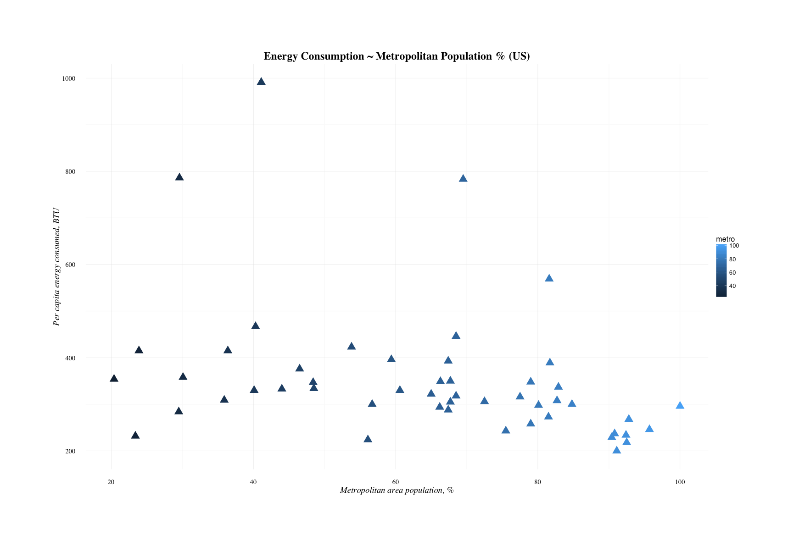
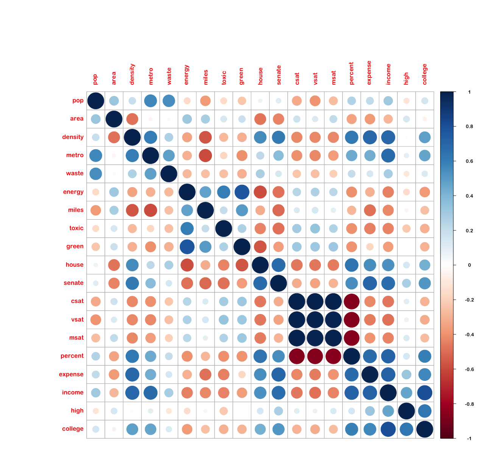
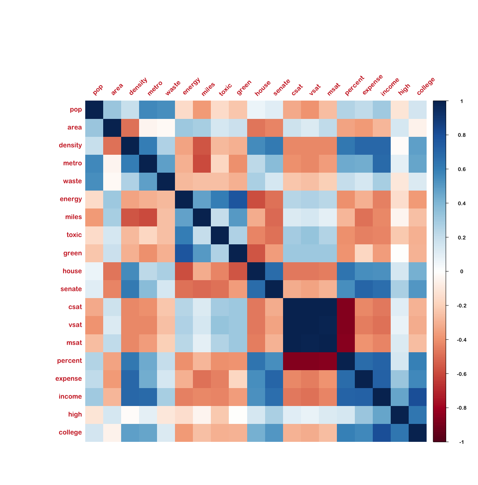

# Linear Regression - Exercise

_Student work in R_

## Least Squares Regression

_instructions per this [tutorial](http://tutorials.iq.harvard.edu/R/Rstatistics/Rstatistics.html#orgheadline16)_

Use the /states.rds/ data set. Fit a model predicting energy consumed per capita (energy) from the percentage of residents living in metropolitan areas (metro). Be sure to

1. Examine/plot the data before fitting the model
2. Print and interpret the model `summary'
3. `plot' the model to look for deviations from modeling assumptions

Select one or more additional predictors to add to your model and repeat steps 1-3. Is this model significantly better than the model with `metro` as the only predictor?

Here is a glimpse of the data:


And information about the variables:


## Process and Analysis

#### Loading State Data and Info

``` r
states.data <- readRDS("data/states.rds")
states.info <- data.frame(attributes(states.data)[c("names", "var.labels")])
```

`states.data` contains the qualitative information on each US State across 21 variables, as seen above. 

There is one categorical variable aside from the state name - `region` - which groups each state into one of four geographic regions across the country (e.g. 'North East, Midwest'). `states.info` contains attribute details for each of the 21 variables in `states.data` - an easy-to-read dataframe explaining the variables. 

#### Preliminary: Correlation Test and Plotting

We'll be taking a look at the relationship between Energy Consumption by State, and the Percentage of the Population Living in Metropolitan Areas. A naive intuition might suggest there's a correlation between the two - the more people there are living in cities, the more power will be used or consumed. 

Before diving directly into a linear model, I thought it'd be a good idea to look at some correlation tests and general plots of the variables of interest. Wherever possible, I like to get a sense of the data before running an algorithm.

``` r
metro.energy <- subset(states.data, select = c("metro", "energy"))
cor(metro.energy)
```

	#        metro energy
	# metro      1     NA
	# energy    NA      1

It looks like the NA values throw off the correlation test. Even though I'd be throwing out data, I'd like to see _some_ value just to get a sense of the data. How many NA's are there? A significant amount?

``` r
is.na(metro.energy)
```

Looks like there is only row of NAs - the District of Columbia. I feel _OK_ to leave this particulaar data out in this instance - just to get an approximate sense of correlation between Metropolitan Population and Energy Consumption. Given the relatively small population of D.C. and it's status as a Federal District rather than state, I'm going to assume there is a reason for the missing data; that it didn't disappear at random. 

``` r
cor(na.omit(metro.energy))
```

	#             metro     energy
	# metro   1.0000000 -0.3397445
	# energy -0.3397445  1.0000000

Seeing a weak downhill linear relationship, in the cor value of -0.339. Now for a quick plot to see where the data points lie before fitting a model. 



While we don't have a linear model yet - I think it's interesting to note the presence of a handful of outliers in Energy Consumption. 

## Model 01 - Energy ~ Metropolitan

Let's run it. 

``` r
energy.metro.mod <- lm(energy ~ metro, data = states.data)
summary(energy.metro.mod)
```
My intuition coming into this was that the more people living in metropolitan areas, the more energy would be consumed per capita. But judging from the Coefficients, the percentage of people living in metropolitan areas doesn't seem to be the strongest predictor of energy consumption:

	# Coefficients:
	#              Estimate Std. Error t value Pr(>|t|)    
	#  (Intercept) 501.0292    61.8136   8.105 1.53e-10 ***
	#  metro        -2.2871     0.9139  -2.503   0.0158 *  

The R-Squared values also appear to suggest a weak relationship: 

	# Multiple R-squared:  0.1154,	Adjusted R-squared:  0.097 

So maybe thinking that people in cities result for the bulk of a state's energy consumption is more of a 'conventional wisdom' than strong or actual correlation. It'd be naive to think the entire country existed in a strictly-divided city/country or urban/rural contrast. 

I plotteed of the model to explore further and see if anything was missed in the assumptions implicit in least squares regression. 


Additionally I thought I'd return to the original ggplot and add a linear model line and some annotations on the outliers and two extreme values within the confidence region. My thinking here is that there might be clues to a stronger predictor of energy consumption in the outlier attributes. 


##  Outlier Commentary

The outliers in this case appear to be states 2, 19, and 51 - Alaska, Louisiana, and Wyoming. 

When ranked by total population, Wyoming and Alaska are the top 2 least populated states, respectively. Louisiana falls toward the middle of this list. 

The same goes for population density.

Wyoming tops the list of `greenhouse` gases released, and Louisiana tops the list of `toxics` released. These factors may be a _result_ rather than _cause_ of Energy Consumption, though. Perhaps they exist dialectically in a 'chicken or the egg'-type of causality dilemma. Either way -  I'm not going to even come close to claiming _any_ *causality* with this exercise, but do find it slightly amusing that a linear model with potentially highly correlated variables could lead to an unsolvable paradox (or more likely, an endless argment).


All three of these outlier states rank in the top 8 least % of House and Senate voting on environmental law. Could it be that legislation is a better predictor of energy consumption than metropolitan population? Again, that could simply be a _result_ rather than strong explanatory variable - respective states' legislative bodies voting to maintain constituencies.

Given that the lowest populations are consuming the most energy - I'm going to venture that industry is what accounts for the outlier spikes, rather than everyday citizens. For `toxics` to be released in large quantities as each of these outlier states do, civilian consumption would not seem to cut it. 

## Correlation Plot 

#### pre-processing

Before fitting a model with variaables of my own choosing, I'd like to do 
a correlation plot to see what relationships exist between the independent variables.

For the moment, I'm going to choose to focus strictly on quantitative data for plotting correlations.

``` r
states.q <- states.data

states.index <- data.frame(state.num = 1:51, state = states.data$state)

states.q$region <- NULL
states.q$state <- NULL

states.cor <- cor(states.q, use = "complete.obs")
states.cor <- round(states.cor, digits = 2)

states.var <- var(states.q, use = "complete.obs")
states.var <- round(states.var, digits = 2)

states.cov <- cov(states.q, use = "complete.obs")
states.cov <- round(states.cov, digits = 2)

write.table(states.cor, file = "state_cor.csv", sep = ",", row.names = T)
write.table(states.var, file = "state_variance.csv", sep = ",", row.names = T)
write.table(states.cov, file = "state_covariance.csv", sep = ",", row.names = T)

#### plotting

``` r
par(mfrow = c(1, 1), mar = c(8, 8, 6, 12), family = "Arial Rounded MT Bold")
corrplot(states.cor)
```

a standard method yields:



``` r
par(mfrow = c(1, 1), mar = c(12, 6, 8, 20), family = "Arial Rounded MT Bold")
corrplot(states.cor, method = "shade", shade.col = NA, tl.col = "firebrick3", 
         tl.srt = 45, tl.cex = 1.0)
``` 
Method: Shade



Order: hclust

``` r
par(mfrow = c(1, 1), mar = c(12, 6, 8, 20), family = "Arial Rounded MT Bold")
corrplot(states.cor, method = "ellipse", order = "hclust", hclust.method = "ward.D",
         tl.col = "firebrick3", tl.srt = 45, tl.cex = 1.0)

```


