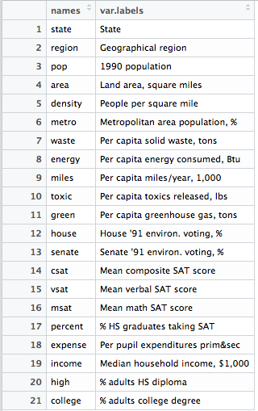

# Linear Regression - Exercise

_Student work in R_

- [Least Squares Regression]
- [Process and Analysis]
- [Loading State Data and Info]
- [Preliminary: Correlation Test and Plotting]
- [Model 01: Energy ~ Metropolitan]
- [Outlier Commentary]
- [Correlation Plot]
- [Model 02: Energy ~ Toxic + Green]
- [Using AIC]
- [Interactions and Factors]
- [Conclusion](#conclusion)
 
## Least Squares Regression

_instructions per this [tutorial](http://tutorials.iq.harvard.edu/R/Rstatistics/Rstatistics.html#orgheadline16)_

Use the /states.rds/ data set. Fit a model predicting energy consumed per capita (energy) from the percentage of residents living in metropolitan areas (metro). Be sure to

1. Examine/plot the data before fitting the model
2. Print and interpret the model `summary'
3. `plot' the model to look for deviations from modeling assumptions

Select one or more additional predictors to add to your model and repeat steps 1-3. Is this model significantly better than the model with `metro` as the only predictor?

Here is a glimpse of the data:


And information about the variables:



## Process and Analysis

#### Loading State Data and Info

``` r
states.data <- readRDS("data/states.rds")
states.info <- data.frame(attributes(states.data)[c("names", "var.labels")])
```

`states.data` contains the qualitative information on each US State across 21 variables, as seen above. 

There is one categorical variable aside from the state name - `region` - which groups each state into one of four geographic regions across the country (e.g. 'North East, Midwest'). `states.info` contains attribute details for each of the 21 variables in `states.data` - an easy-to-read dataframe explaining the variables. 

#### Preliminary: Correlation Test and Plotting

We'll be taking a look at the relationship between Energy Consumption by State, and the Percentage of the Population Living in Metropolitan Areas. A naive intuition might suggest there's a correlation between the two - the more people there are living in cities, the more power will be used or consumed. 

Before diving directly into a linear model, I thought it'd be a good idea to look at some correlation tests and general plots of the variables of interest. Wherever possible, I like to get a sense of the data before running an algorithm.

``` r
metro.energy <- subset(states.data, select = c("metro", "energy"))
cor(metro.energy)
```

	#        metro energy
	# metro      1     NA
	# energy    NA      1

It looks like the NA values throw off the correlation test. Even though I'd be throwing out data, I'd like to see _some_ value just to get a sense of the data. How many NA's are there? A significant amount?

``` r
is.na(metro.energy)
```

Looks like there is only row of NAs - the District of Columbia. I feel _OK_ to leave this particulaar data out in this instance - just to get an approximate sense of correlation between Metropolitan Population and Energy Consumption. Given the relatively small population of D.C. and it's status as a Federal District rather than state, I'm going to assume there is a reason for the missing data; that it didn't disappear at random. 

``` r
cor(na.omit(metro.energy))
```

	#             metro     energy
	# metro   1.0000000 -0.3397445
	# energy -0.3397445  1.0000000

Seeing a weak downhill linear relationship, in the cor value of -0.339. Now for a quick plot to see where the data points lie before fitting a model. 


While we don't have a linear model yet - I think it's interesting to note the presence of a handful of outliers in Energy Consumption. 

## Model 01 - Energy ~ Metropolitan

Let's run it. 

``` r
energy.metro.mod <- lm(energy ~ metro, data = states.data)
summary(energy.metro.mod)
```
My intuition coming into this was that the more people living in metropolitan areas, the more energy would be consumed per capita. But judging from the Coefficients, the percentage of people living in metropolitan areas doesn't seem to be the strongest predictor of energy consumption:

	# Coefficients:
	#              Estimate Std. Error t value Pr(>|t|)    
	#  (Intercept) 501.0292    61.8136   8.105 1.53e-10 ***
	#  metro        -2.2871     0.9139  -2.503   0.0158 *  

The R-Squared values also appear to suggest a weak relationship: 

	# Multiple R-squared:  0.1154,	Adjusted R-squared:  0.097 

So maybe thinking that people in cities result for the bulk of a state's energy consumption is more of a 'conventional wisdom' than strong or actual correlation. It'd be naive to think the entire country existed in a strictly-divided city/country or urban/rural contrast. 

I plotteed of the model to explore further and see if anything was missed in the assumptions implicit in least squares regression. 


Additionally I thought I'd return to the original ggplot and add a linear model line and some annotations on the outliers and two extreme values within the confidence region. My thinking here is that there might be clues to a stronger predictor of energy consumption in the outlier attributes. 


##  Outlier Commentary

The outliers in this case appear to be states 2, 19, and 51 - Alaska, Louisiana, and Wyoming. 

When ranked by total population, Wyoming and Alaska are the top 2 least populated states, respectively. Louisiana falls toward the middle of this list. 

The same goes for population density.

Wyoming tops the list of `greenhouse` gases released, and Louisiana tops the list of `toxics` released. These factors may be a _result_ rather than _cause_ of Energy Consumption, though. Perhaps they exist dialectically in a 'chicken or the egg'-type of causality dilemma. Either way -  I'm not going to even come close to claiming _any_ *causality* with this exercise, but do find it slightly amusing that a linear model with potentially highly correlated variables could lead to an unsolvable paradox (or more likely, an endless argment).


All three of these outlier states rank in the top 8 least % of House and Senate voting on environmental law. Could it be that legislation is a better predictor of energy consumption than metropolitan population? Again, that could simply be a _result_ rather than strong explanatory variable - respective states' legislative bodies voting to maintain constituencies.

Given that the lowest populations are consuming the most energy - I'm going to venture that industry is what accounts for the outlier spikes, rather than everyday citizens. For `toxics` to be released in large quantities as each of these outlier states do, civilian consumption would not seem to cut it. 

## Correlation Plot 

#### pre-processing

Before fitting a model with variaables of my own choosing, I'd like to do 
a correlation plot to see what relationships exist between the independent variables.

For the moment, I'm going to choose to focus strictly on quantitative data for plotting correlations.

``` r
states.q <- states.data

states.index <- data.frame(state.num = 1:51, state = states.data$state)

states.q$region <- NULL
states.q$state <- NULL

states.cor <- cor(states.q, use = "complete.obs")
states.cor <- round(states.cor, digits = 2)

```

Order: hclust

``` r
par(mfrow = c(1, 1), mar = c(12, 6, 8, 20), family = "Arial Rounded MT Bold")
corrplot(states.cor, method = "ellipse", order = "hclust", hclust.method = "ward.D",
         tl.col = "firebrick3", tl.srt = 45, tl.cex = 1.0)

```


Looking at the correlation matrix, we can see the strongest uphill correlations to `energy` in `toxic` and `green`, while seeing the strongest downhill correlations in `house`	 and `senate`. s

## Model 02 - Energy ~ Toxics + Green

My initial thought was to test the independent variables `toxic`, `green`, and `waste` together with `metro`. 

``` r
summary(lm(energy ~ waste + toxic + green + metro, data = states.data))
# Coefficients:
#               Estimate Std. Error t value Pr(>|t|)    
#  (Intercept) 150.3571    49.6130   3.031  0.00412 ** 
#  waste        13.3368    41.9194   0.318  0.75191    
#  toxic         2.6957     0.4852   5.556 1.61e-06 ***
#  green         4.8176     0.5908   8.154 2.87e-10 ***
#  metro         0.1831     0.4718   0.388  0.69984   
```

After seeing these results, I'm going to eliminate the `waste` and `metro` variables to see how strong of a model can be built. 

``` r
toxic.green.model <- lm(energy ~ toxic + green, data = states.data)
summary(toxic.green.model)

#   Coefficients:
#              Estimate Std. Error t value Pr(>|t|)    
#  (Intercept) 179.8260    16.1194  11.156 1.51e-14 ***
#  toxic         2.6455     0.4676   5.657 1.01e-06 ***
#  green         4.6722     0.5336   8.756 2.81e-11 ***

#   Multiple R-squared:  0.7627,	Adjusted R-squared:  0.7521
```

This model has the highest R-squared and coefficient significance yet. Could it be that toxic and green are too highly correlated, or exhibiting multicolllinearity? Also, could energy consumption and greenhouse gas emissions be too correlated? 

``` r
cor(states.data$toxic, states.data$green, use = "pairwise")
# 0.2622973
cor(states.data$toxic, states.data$energy, use = "pairwise")
# 0.5624524
cor(states.data$green, states.data$energy, use = "pairwise")
# 0.7706181
```

Let's plot and take a look:

``` r
energy.toxic.plot <- ggplot(states.data, aes(toxic, energy)) +
  theme_minimal() +
  geom_point(aes(color = toxic), size = 4.75, shape = 17) +
  stat_smooth(method = lm, se = FALSE, colour = "#CD2626") +
  ggtitle("Energy Consumption ~ Per capita toxics released (US)") +
  theme(plot.title = element_text(family = "Times", face = "bold", size = 18)) +
  labs(x = "Per capita toxics released, lbs.", y = "Per capita energy consumed, BTU") +
  theme(axis.title.x = element_text(family = "Times", face = "italic", size = 14)) +
  theme(axis.title.y = element_text(family = "Times", face = "italic", size = 14)) +
  theme(axis.text.x = element_text(family = "Times", face = "plain", size = 11)) +
  theme(axis.text.y = element_text(family = "Times", face = "plain", size = 11)) +
  theme(plot.margin = unit(c(3, 3, 3, 3), "cm"))

energy.toxic.plot
```


``` r
energy.green.plot <- ggplot(states.data, aes(green, energy)) +
  theme_minimal() +
  geom_point(aes(color = green), size = 4.75, shape = 17) +
  stat_smooth(method = lm, se = FALSE, colour = "#CD2626") +
  ggtitle("Energy Consumption ~ Per capita greenhouse gas (US)") +
  theme(plot.title = element_text(family = "Times", face = "bold", size = 18)) +
  labs(x = "Per capita greenhouse gas, tons", y = "Per capita energy consumed, BTU") +
  theme(axis.title.x = element_text(family = "Times", face = "italic", size = 14)) +
  theme(axis.title.y = element_text(family = "Times", face = "italic", size = 14)) +
  theme(axis.text.x = element_text(family = "Times", face = "plain", size = 11)) +
  theme(axis.text.y = element_text(family = "Times", face = "plain", size = 11)) +
  theme(plot.margin = unit(c(3, 3, 3, 3), "cm"))

energy.green.plot
```


So this model appears to be stronger than the original model using Metropolitan percentage. But my intuition again says that cause and effect, while they cannot be definitely inferred, are still too confused using these variables. I.E., greenhouse gas emissions could be a result of energy consumption, rather than an explanation for it.

``` r
confint(toxic.green.model)
                 2.5 %     97.5 %
(Intercept) 147.359753 212.292223
toxic         1.703605   3.587324
green         3.597436   5.747016
```

#### Using AIC to choose a model

Just as another 'check', I thought I'd try using `step()` and the Akaike Information Criterion for model selection. First to clean up some of the data - dealing with factors.

``` r
states.factors <- states.data
states.factors$state <- as.factor(states.factors$state)
states.factors$state <- NULL
```

And now to fit the model.

``` r
model <- lm(energy ~ ., data = states.factors)
summary(model)

Coefficients: (1 not defined because of singularities)
                 Estimate Std. Error t value Pr(>|t|)    
 (Intercept)   -2.363e+02  5.794e+02  -0.408  0.68667    
 regionN. East  4.008e-01  6.942e+01   0.006  0.99544    
 regionSouth    7.089e+01  4.717e+01   1.503  0.14445    
 regionMidwest  4.577e+01  4.300e+01   1.064  0.29658    
 pop           -2.480e-07  3.866e-06  -0.064  0.94931    
 area           8.315e-04  3.766e-04   2.208  0.03594 *  
 density        3.904e-02  9.142e-02   0.427  0.67270    
 metro          2.549e-01  9.508e-01   0.268  0.79063    
 waste         -1.449e+01  6.244e+01  -0.232  0.81824    
 miles          4.013e+00  1.558e+01   0.258  0.79868    
 toxic          2.510e+00  6.768e-01   3.709  0.00095 ***
 green          4.527e+00  9.412e-01   4.809 5.08e-05 ***
 house          1.624e-01  1.010e+00   0.161  0.87340    
 senate        -8.870e-02  6.475e-01  -0.137  0.89206    
 csat          -1.719e+00  2.826e+00  -0.608  0.54808    
 vsat           3.761e+00  5.926e+00   0.635  0.53095    
 msat                  NA         NA      NA       NA    
 percent        8.267e-01  1.695e+00   0.488  0.62962    
 expense        1.455e-02  1.627e-02   0.894  0.37915    
 income         2.941e-01  4.679e+00   0.063  0.95034    
 high           3.301e+00  4.806e+00   0.687  0.49802    
 college       -6.965e+00  6.358e+00  -1.096  0.28296    

 Multiple R-squared:  0.8379,  Adjusted R-squared:  0.7178 
 F-statistic: 6.978 on 20 and 27 DF,  p-value: 3.173e-06
```

Toxic and green again show up as the strongest independent variables. 

``` r
aic <- step(model)
summary(aic)
```

This didn't really look great. What about getting rid of half the variables related to college testing, that don't seem to be relevant?

``` r
states.factors$college <- NULL
states.factors$msat <- NULL
states.factors$vsat <- NULL
states.factors$csat <- NULL
states.factors$expense <- NULL
states.factors$percent <- NULL
states.factors$high <- NULL

model02 <- lm(energy ~ ., data = states.factors)
summary(model02)
```

Significant coefficients again are toxic and green. Of less significance are area and just barely - regionSouth.

``` r
aic02 <- step(model02)
 Step:  AIC=391.48
 energy ~ region + area + toxic + green

              Df Sum of Sq    RSS    AIC
     - region  3     16412 141324 391.41
     <none>                124912 391.48
     - area    1     17972 142884 395.93
     - toxic   1     77706 202618 412.70
     - green   1    238288 363200 440.71

  Step:  AIC=391.41
  energy ~ area + toxic + green

            Df Sum of Sq    RSS    AIC
    <none>               141324 391.41
    - area   1     11258 152582 393.08
    - toxic  1     99897 241221 415.07
    - green  1    237987 379311 436.80
  ```

With college test and high school expense variables removed, we have the lowest AIC values again in the toxic, green, and area variables. 

```r
step(toxic.green.model)
    Start:  AIC=393.08
    energy ~ toxic + green

           Df Sum of Sq    RSS    AIC
    <none>               152582 393.08
    - toxic  1    108514 261096 416.87
    - green  1    259929 412511 438.82
```

Our original model using `metro` as an estimator of `energy` consumption comes in with a much higher AIC value.   

``` r
step(energy.metro.mod)
    Start:  AIC=496.25
    energy ~ metro

            Df Sum of Sq     RSS    AIC
    <none>                943103 496.25
    - metro  1    123064 1066166 500.38
```

## Exercise Part 2: Interactions and Factors

_instructions:_

Use the states data set.

1. Add on to the regression equation that you created in exercise 1 by generating an interaction term and testing the interaction.

2. Try adding region to the model. Are there significant differences across the four regions?

``` r
toxic.green.interaction <- lm(energy ~ (toxic + green)*area, data = states.data)
summary(toxic.green.interaction)
```

``` r
toxic.green.region <- lm(energy ~ toxic+green+region, data = states.data)
summary(toxic.green.region)
```

```
levels(states.data$region)
"West"    "N. East" "South"   "Midwest"

energy.region <- lm(energy ~ region, data = states.data)
summary(energy.region)
 Coefficients:
                      Estimate Std. Error t value Pr(>|t|)    
       (Intercept)     405.62      39.23  10.339  1.4e-13 ***
       regionN. East  -156.50      61.34  -2.552   0.0141 *  
       regionSouth     -25.49      52.82  -0.483   0.6317    
       regionMidwest   -61.62      56.63  -1.088   0.2822  
```

```r
anova(energy.region)
           Df Sum Sq Mean Sq F value  Pr(>F)  
 region     3 145757   48586  2.4282 0.07737 .
 Residuals 46 920410   20009   
```

## Conclusion

From the `energy.region` model above, we see the only region not included in the coefficients is the West. This wikipedia [article](https://en.wikipedia.org/wiki/Energy_in_the_United_States#Regional_variation) also cites region a highly variable factor in household energy consumption - particularly, with much lower consumption in Western states due to less extremes in climate. Also mentioned in this portion of the article are state laws in regard to environmental laws - citing that California has the strictest laws in place, suggesting a reason for the lower energy consumption. This would be consistent with the `house` and `senate` environmental voting variables that were correlated with energy consumption from earlier.

Looking back to the energy outliers [Alaska](http://www.eia.gov/state/?sid=AK), [Lousiana](http://www.eia.gov/state/?sid=LA), and [Wyoming](http://www.eia.gov/state/?sid=WY), we see that they are leaders in the production of Oil, Crude Oil/Natural Gas, and Coal, respectively. Being major industries for these states, it makes sense that their `house` and `senate` voting patterns on environmental law would be consistent with more lax environmental standards. 

While these states were outliers in that they are leaders in energy production(which costs energy to do), it might be interesting to see where the energy they produce is used and distributed across the states.
