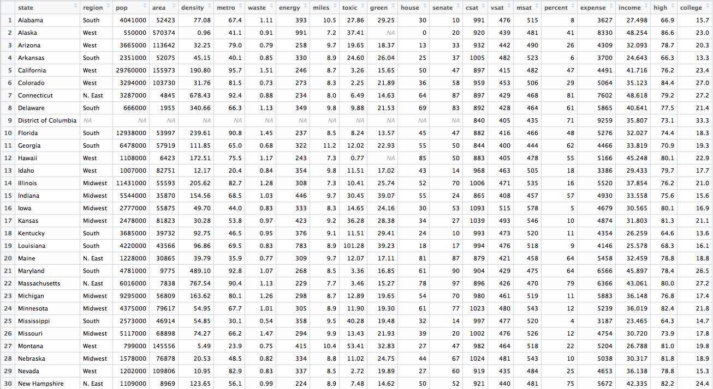
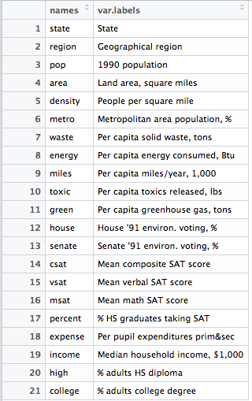

Linear Regression - Exercise
============================

_Student work in R_

This is an exercise in fitting a linear regression model to data, as part of Springboard's [Foundations of Data Science](https://www.springboard.com/workshops/data-science/learn#1090-data-analysis-in-depth) class. The exercise is adapted from Harvard University's [statistical software workshop](http://tutorials.iq.harvard.edu/R/Rstatistics/Rstatistics.html).

- [Instructions](master/instructions)
- [Data](data)
- [Process and Analysis](process-analysis.md)

## Instructions

#### Exercise: least squares regression

Use the /states.rds/ data set. Fit a model predicting energy consumed per capita (energy) from the percentage of residents living in metropolitan areas (metro). Be sure to

1. Examine/plot the data before fitting the model
2. Print and interpret the model `summary'
3. `plot' the model to look for deviations from modeling assumptions

Select one or more additional predictors to add to your model and repeat steps 1-3. Is this model significantly better than the model with /metro/ as the only predictor?

Here is a glimpse of the data:

And information about the variables:

## Process and Analysis

